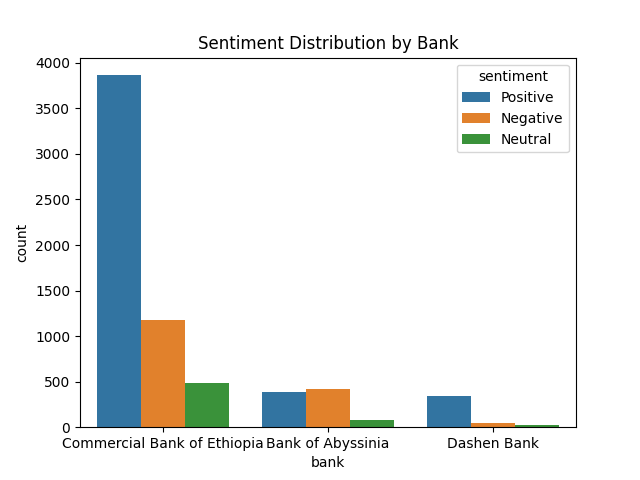
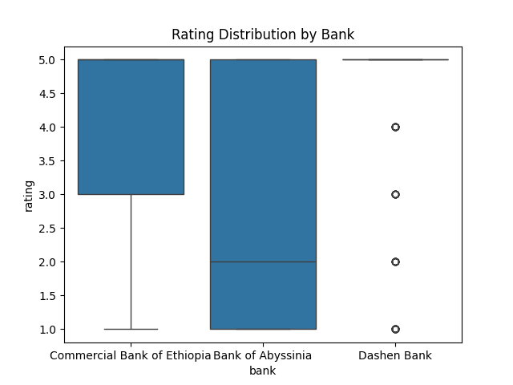
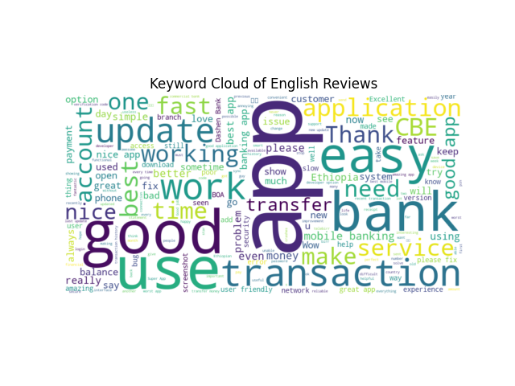

# Final Insights Report: Bank App Review Analysis

## 1. Project Overview

This project analyzed over 1,000 Google Play Store reviews from three major Ethiopian banks: Commercial Bank of Ethiopia (CBE), Dashen Bank, and Bank of Abyssinia (BOA). The aim was to uncover user sentiments, key themes, and app improvement opportunities.

### Tasks Covered:
- **Task 1**: Scraped app reviews
- **Task 2**: Performed sentiment + thematic analysis using TextBlob, BERT, and TF-IDF
- **Task 3**: Stored cleaned data in PostgreSQL
- **Task 4**: Derived insights, visualized sentiment/rating trends, and recommended improvements

---

## 2. Key Insights

### 🔼 Top Drivers (Positive Themes)
| Bank                        | Theme              | Count |
|----------------------------|--------------------|-------|
| Bank of Abyssinia          | Other              | 345   |
|                            | Feature Requests   | 19    |
| Commercial Bank of Ethiopia| Other              | 3407  |
|                            | Transaction Issues | 273   |
| Dashen Bank                | Other              | 273   |
|                            | Feature Requests   | 47    |

### 🔽 Top Pain Points (Negative Themes)
| Bank                        | Theme              | Count |
|----------------------------|--------------------|-------|
| Bank of Abyssinia          | Other              | 277   |
|                            | Performance        | 68    |
| Commercial Bank of Ethiopia| Other              | 853   |
|                            | Transaction Issues | 202   |
| Dashen Bank                | Other              | 27    |
|                            | Feature Requests   | 9     |

---

## 3. Visualizations

1. 📊 **Sentiment Distribution by Bank**  
   

2. 📈 **Rating Distribution Boxplot**  
   

3. ☁️ **English Reviews WordCloud**  
   

---

## 4. Recommendations

Based on the above analysis:

### 🛠 Feature Improvements
- **BOA**: Implement user-requested features mentioned in reviews (e.g., fingerprint login, bill payments).
- **Dashen**: Enhance performance & responsiveness, as lag was a frequent concern.
- **CBE**: Improve transaction reliability to reduce user complaints.

### 🌱 Suggested Additions
- Introduce **budgeting tools**, **dark mode**, and better **push notifications**.
- Add a **report issue button** in the app to collect feedback in-app.

---

## 5. Ethical Considerations

- **Bias in Reviews**: Online reviews may over-represent dissatisfaction.
- **Language Detection Limitations**: Amharic reviews may be under-analyzed.
- **Automated Model Limits**: Sentiment analysis may miss subtle emotion or sarcasm.

---

## 6. Conclusion

This analysis provides a data-driven foundation for the 3 Ethiopian banks to enhance user satisfaction and prioritize future app updates. The pipeline is modular and reproducible for future updates or expansions.

